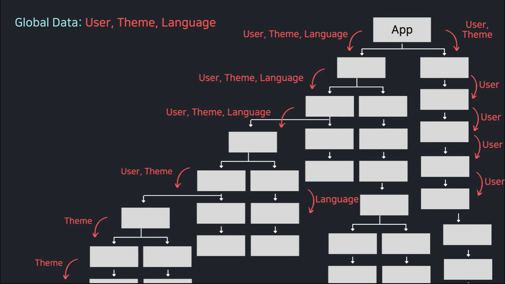
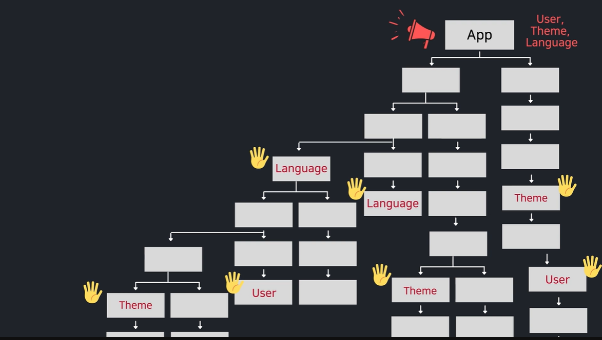

# useContext

## useContext 쓰는 이유
컴포넌트 간 데이터 전달 시 props를 사용할 수 있다.<br>
그러나, 만약 컴포넌트가 매우 많고 구조가 복잡하다면 최상위 컴포넌트에서 최하위 컴포넌트로 <br>
데이터를 이동할 땐 일일이 하위 단계의 컴포넌트로 props를 넘겨줘야하는 번거로움이 생긴다.


props를 사용하여 데이터를 전달할 때

<br>

context를 사용하여 데이터를 전달할 때

<br>

위 그림처럼 useContext를 사용한다는 것은 상위컴포넌트에서 모든 하위 컴포넌트에게 <br>데이터를 전달 해주는 **방송**을 해주는 것과 빗댈 수 있다.<br>
하위 컴포넌트 중 상위컴포넌트가 전달하는 데이터가 필요한 컴포넌트만 데이터를 전달 받을 수 있고,<br>
그 과정에서 일일이 하위컴포넌트로 데이터를 전달하는 번거로운 짓도 생략할 수 있다.

<br>

## 사용법
Context를 생성한다.
```js
// Contexts/ThemeContext
import { createContext } from "react";
export const ThemeContext = createContext(null);
// 이때 createContext()의 매개변수는 부모컴포넌트가 
// Provider로 하위컴포넌트를 감싸지 않았을 때 
// 하위컴포넌트에게 전달될 기본값을 의미한다.
```

<br>

Context를 import하고 상위 컴포넌트에서 Provider로 하위 컴포넌트를 감싼다.
```js
// Hooks/UseContext.js
import React, { useState } from "react";
import Page from "../components/Page";
import "../style/UseContext.css";
import { ThemeContext } from "../Contexts/ThemeContext";

function UseContext() {
	const [isDark, setIsDark] = useState(false);

	return (
			//Provider로 하위컴포넌트들에게 isDark와 setIsDark를 객체로 넘겨줌
			<ThemeContext.Provider value={{ isDark, setIsDark }}>
				<Page />
			</ThemeContext.Provider>
	);
}
export default UseContext;
```

<br>

어느 하위컴포넌트든 useContext()로 상위컴포넌트가 전달한 데이터를 받을 수 있다.
```js
// components/Header.js

// Header컴포넌트의 부모컴포넌트는 Page.js이다.
import React, { useContext } from "react";
import { ThemeContext } from "../Contexts/ThemeContext";

const Header = () => {
	const { isDark } = useContext(ThemeContext); // 상위컴포넌트 데이터 전달받기
	return (
		<header
			className="header"
			style={{
				backgroundColor: isDark ? "black" : "lightgray",
				color: isDark ? "white" : "black",
			}}>
			<h1>Welcome, 신준서!</h1>
		</header>
	);
};

export default Header;
```
